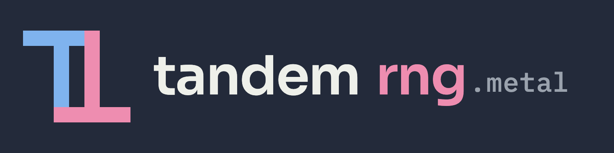

<p align="center"></p>

# tandem-metal

[](https://github.com/tandem-rng/tandem-metal/actions/workflows/ci.yml)
[](https://tandem-rng.github.io/tandem-metal/)
[](LICENSE)

Metal and Swift implementation of [Tandem8x32](https://github.com/tandem-rng/spec), a
noncryptographic pseudorandom number generator. Metal kernels fill GPU buffers and a Swift
package draws on the CPU, bit for bit with the specification and tandem-c.

Add the package with swift-tools-version 6.0 or later on macOS 15 or later. Metal has no double
type, so Float64 draws run on the CPU.

```swift
.package(url: "https://github.com/tandem-rng/tandem-metal", branch: "main")   // Package.swift
```

```swift
import Metal
import Tandem

let kernels = try TandemKernels(device: MTLCreateSystemDefaultDevice()!) // compiles the shader
var rng = Tandem(seed: 42)                     // 128-bit seed through the spec's whitening
let buffer = kernels.device.makeBuffer(length: 4 << 20, options: .storageModePrivate)!
rng.fill(.u32, count: 1 << 20, buffer: buffer, kernels: kernels)            // blocks until done
let worker = rng.split(7)                      // by index, from the key alone
rng.fill(.normalF32, count: 1 << 20, buffer: buffer, kernels: kernels)     // Box-Muller, as tandem-c
```

See [API](docs/api.md) for every GPU and CPU fill, and [design](docs/design.md),
[tests](docs/tests.md) and [speed](docs/speed.md) for the rest. Run the tests with `swift test`.

Portions of the code were generated with the assistance of LLMs.

[Documentation](https://tandem-rng.github.io/tandem-metal/) · [Apache 2.0 license](LICENSE)
